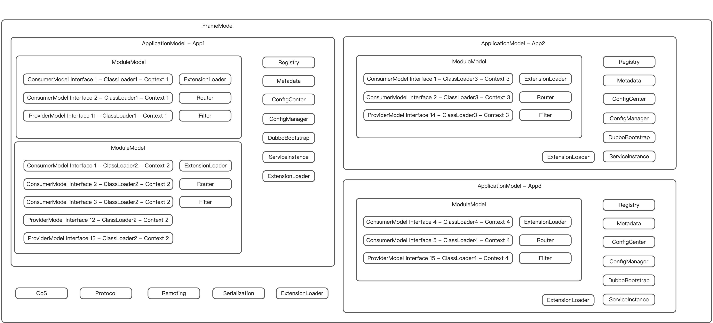

# dubbo-multi-instance-design

## 设计

三层模型配置，分别是 Framework 框架层、Application 应用层、Module 模块层。 基于三层机制，我们可以将 Dubbo 按照一定规则进行隔离：

- Framework 与 Framework 之间完全隔离，相当于是使用了两个完全不同的 Dubbo 实例
- Application 与 Application 之间按照应用名进行隔离，但是相互有些地共享 Protocol、Serialization 层，目标是达到在同一个 dubbo 端口（20880）上可以承载多个应用，而每个应用独立上报地址信息。
- Module 与 Module 之间可以由用户自定义进行进行隔离，可以是热部署周期的一个状态、也可以是 Spring Context 的一个 Context。通过 Module，用户可以对 Dubbo 的生命周期粒度进行最小的管理。

为了实现 Dubbo 多实例化，Dubbo 框架内做的最多的变化是修改掉大部分的从静态变量中获取的参数的逻辑。
最明显的逻辑是 Dubbo 内部用于参数传递的 URL 对象带上了 ScopeModel 状态，这个 ScopeModel 对应的就是上面提到的三层模型的具体数据承载对象。

---

## 架构

JVM —— 虚拟机层 目的：Dubbo 框架之间完全隔离（端口不能复用）

Dubbo Framework —— 框架层 目的：将需要全局缓存的进行复用（端口、序列化等）

Application —— 应用层 目的：隔离应用之间的信息，包括注册中心、配置中心、元数据中心

Services —— 模块层 目的：提供热加载能力，可以按 ClassLoader、Spring Context 进行隔离上下文

## 参考

[dubbo-multi-instance-design](https://cn.dubbo.apache.org/zh-cn/overview/mannual/java-sdk/reference-manual/architecture/multi-instance/multi-instance/)
[dubbo-architecture](https://cn.dubbo.apache.org/zh-cn/overview/mannual/java-sdk/reference-manual/architecture/multi-instance/model/)]
