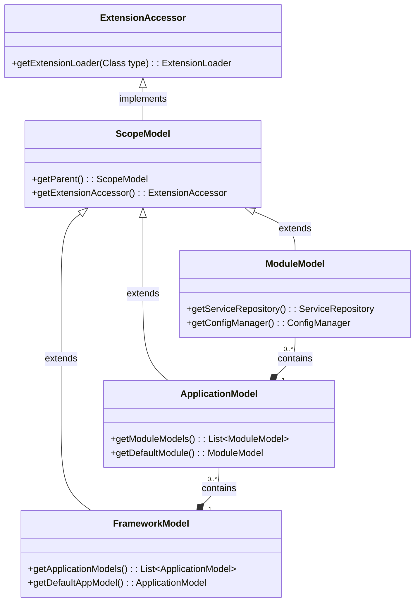

# dubbo-domain-model

> Dubbo3 的领域模型

## 简介

在 Dubbo3 的新版本中加入框架（Framework）、应用（Application）、模块（Module）领域模型。之前 Dubbo 都是只有一个作用域的，通过静态类、属性共享。

增加域模型是为了:
- 让Dubbo支持多应用的部署
- 从架构设计上，解决静态属性资源共享、清理的问题
- 分层模型将应用的管理和服务的管理分开

Dubbo3中在启动时候需要启动配置中心、元数据中心，这个配置中心（ConfigManager）和元数据中心可以归应用（Application）模型来管理。

Dubbo作为RPC框架又需要启动服务和引用服务，服务级别的管理就交给了这个模块模型来管理。

分层次的管理方便理解和处理逻辑，父子级别的模型又方便了数据传递。

JVM类加载过程中：子类加载器先交给父类加载器查找，找不到再从子类加载器中查找。Dubbo的分层模型类似这样一种机制，

---

## 模型类图

---

## 相关类解析

- **ExtensionAccessor**: 扩展的统一访问器。
  - 用于获取扩展加载管理器 ExtensionDirector 对象
- **ExtensionDirector**: 统一的扩展管理器。
  - 支持不同的 Scope，用 ExtensionScope 来表示
  - 扩展加载的逻辑类似 JVM 类加载机制
  - 子 ExtensionDirector 可继承父 ExtensionDirector
- **ExtensionScope**: SPI 扩展作用域
  - ExtensionScope.FRAMEWORK 整个 Dubbo 框架（对应 FrameworkModel），所有 ApplicationModel 和 ModuleModel 共享同一个实例
  - ExtensionScope.APPLICATION 单个应用（对应 ApplicationModel），该应用下的所有 ModuleModel 共享同一个实例
  - ExtensionScope.MODULE 单个模块（对应 ModuleModel），每个模块拥有独立的扩展实例
  - ExtensionScope.SELF 每次获取都创建新实例（不缓存）
- **ScopeModel**: 模型对象的公共抽象父类型
  - 内部id用于表示模型树的层次结构
- **FrameworkModel**: 整个 Dubbo 框架（对应 FrameworkModel）
  - 所有ApplicationModel实例对象集合，applicationModels
  - 发布的ApplicationModel实例对象集合pubApplicationModels
- **ApplicationModel**: 同一个 Dubbo 框架下的不同 Application（如 Dubbo 多个应用运行在同一个 JVM 上）
- **ModuleModel**: 同一个 Dubbo Application 下不同的模块（如 微服务拆分模块）

---

## ExtensionScope 扩展作用域

在 Dubbo 3 多应用/多模块架构下，一个 JVM 中可能运行多个 ApplicationModel（如 Spring Boot 多应用部署）或多个 ModuleModel（如微服务拆分模块）。
传统全局单例的 SPI 扩展（如 Protocol、Registry）无法满足 隔离性 或 共享性 的需求。

因此，Dubbo 引入 ExtensionScope，让 SPI 扩展可以：

在框架级共享（如日志、元数据管理）
在应用级隔离（如注册中心配置）
在模块级隔离（如服务暴露/引用配置）
配合 ExtensionDirector（扩展管理器），Dubbo 能为不同作用域创建和缓存独立的扩展实例。

---

## 参考

- [框架,应用程序,模块领域模型](https://cn.dubbo.apache.org/zh-cn/blog/2022/08/03/03-%e6%a1%86%e6%9e%b6%e5%ba%94%e7%94%a8%e7%a8%8b%e5%ba%8f%e6%a8%a1%e5%9d%97%e9%a2%86%e5%9f%9f%e6%a8%a1%e5%9e%8bmodel%e5%af%b9%e8%b1%a1%e7%9a%84%e5%88%9d%e5%a7%8b%e5%8c%96/)
