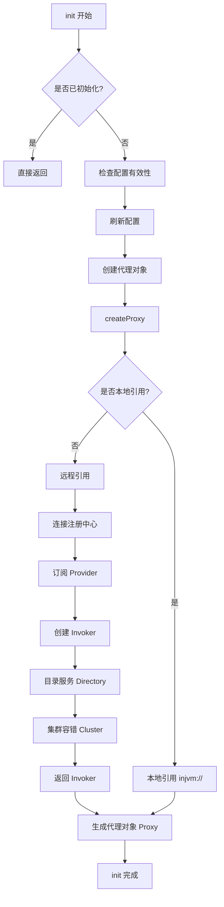

# Dubbo 源码分析：服务引用配置原理

> ReferenceConfig 的初始化过程及服务引用的流程。

---

- [服务引用概述](#服务引用概述)
- [ReferenceConfig 的生命周期](#referenceconfig-的生命周期)
- [init 方法核心流程](#init-方法核心流程)
- [createProxy() 方法详解](#createProxy-方法详解)
- [Invoker 的创建](#invoker-的创建)
- [代理对象的生成](#代理对象的生成)
- [总结](#总结)
- [延伸阅读](#延伸阅读)

---

## 服务引用概述

### 什么是服务引用？

在 Dubbo 中，**服务引用（Service Reference）** 是指 Consumer 从注册中心发现 Provider，并创建本地代理对象的过程。

消费者创建的第一步就是先进行消费者信息的配置，对应类型为 ReferenceConfig，对应的代码为：

```java
ReferenceConfig<DemoService> reference = new ReferenceConfig<>();
```

**Consumer 端的核心代码：**

```java
// 1. 创建服务引用配置
ReferenceConfig<DemoService> reference = new ReferenceConfig<>();
reference.setInterface(DemoService.class);

// 2. 启动 Dubbo Bootstrap
DubboBootstrap.getInstance()
    .application(new ApplicationConfig("dubbo-demo-api-consumer"))
    .registry(new RegistryConfig("zookeeper://127.0.0.1:2181"))
    .reference(reference)  // 添加服务引用
    .start();              // 触发初始化

// 3. 获取代理对象
DemoService demoService = bootstrap.getCache().get(reference);
```

**服务引用的核心任务：**

1. **连接注册中心**：从 ZooKeeper 获取 Provider 列表
2. **服务发现**：订阅服务变更通知
3. **建立连接**：与 Provider 建立 TCP 连接
4. **创建代理**：生成本地代理对象
5. **配置管理**：加载超时、重试等配置

---

## ReferenceConfig 的生命周期

### 完整生命周期

```
┌─────────────────────────────────────────────────────────────────┐
│                    ReferenceConfig 生命周期                      │
├─────────────┬─────────────┬─────────────┬─────────────┬─────────┤
│   创建阶段   │  初始化阶段  │   就绪阶段   │   使用阶段   │  销毁阶段│
│             │             │             │             │         │
│ new         │ init()      │ 订阅完成     │ 远程调用     │destroy()│
│ Reference   │   ↓         │   ↓         │   ↓         │    ↓    │
│ Config      │ 创建Invoker │ 收到Provider │ proxy.invoke│ 注销订阅 │
│             │   ↓         │   列表       │             │         │
│             │ 创建Proxy   │             │             │         │
└─────────────┴─────────────┴─────────────┴─────────────┴─────────┘
                    ↑
              本文重点关注
```

### 触发时机

`ReferenceConfig.init()` 的触发时机：

```java
// 方式一：显式调用 get()
DemoService service = reference.get();  // 内部调用 init()
// 方式二：通过缓存获取
DemoService service = bootstrap.getCache().get(reference);  // 首次获取时调用 init()
```

**关键代码路径**

`org.apache.dubbo.config.ReferenceConfig.get`

```java
public T get(boolean check) {
    // ...
    if (ref == null) {
        // ...
        init(check);
    }
    return ref;
}
```

---

## init() 方法核心流程

### 整体流程图



### 核心代码分析

**ReferenceConfig.java:383 - init() 方法：**

```java
public synchronized void init(boolean check) {
    // 1. 防止重复初始化
    if (initialized.compareAndSet(false, true)) {
        if (bootstrap == null) {
            bootstrap = DubboBootstrap.getInstance();
        }

        // 2. 检查配置的有效性
        checkAndUpdateSubConfigs();

        // 3. 刷新配置（从配置中心拉取）
        serviceMetadata.setVersion(version);
        serviceMetadata.setGroup(group);
        serviceMetadata.setServiceType(getServiceInterfaceClass());
        serviceMetadata.setServiceInterfaceName(interfaceName);

        // 4. 创建代理对象（核心！）
        ref = createProxy(invoker);

        // 5. 设置服务元数据
        serviceMetadata.setTarget(ref);
        serviceMetadata.addAttribute(PROXY_CLASS_REF, ref);
    }
}
```

```java
protected void init(boolean check) {
    lock.lock(); // 防止重复初始化
    try {
        if (initialized && ref != null) {
            return;
        }
        try {
            if (!this.isRefreshed()) {
                this.refresh();
            }
            // auto detect proxy type
            String proxyType = getProxy();
            if (StringUtils.isBlank(proxyType) && DubboStub.class.isAssignableFrom(interfaceClass)) {
                setProxy(CommonConstants.NATIVE_STUB);
            }

            // init serviceMetadata
            // 初始化配置，从配置中心拉取 or 本地配置？
            initServiceMetadata(consumer);

            serviceMetadata.setServiceType(getServiceInterfaceClass());
            // TODO, uncomment this line once service key is unified
            serviceMetadata.generateServiceKey();

            Map<String, String> referenceParameters = appendConfig();

            ModuleServiceRepository repository = getScopeModel().getServiceRepository();
            ServiceDescriptor serviceDescriptor;
            if (CommonConstants.NATIVE_STUB.equals(getProxy())) {
                serviceDescriptor = StubSuppliers.getServiceDescriptor(interfaceName);
                repository.registerService(serviceDescriptor);
                setInterface(serviceDescriptor.getInterfaceName());
            } else {
                serviceDescriptor = repository.registerService(interfaceClass);
            }
            consumerModel = new ConsumerModel(
                serviceMetadata.getServiceKey(),
                proxy,
                serviceDescriptor,
                getScopeModel(),
                serviceMetadata,
                createAsyncMethodInfo(),
                interfaceClassLoader);

            // Compatible with dependencies on ServiceModel#getReferenceConfig() , and will be removed in a future
            // version.
            consumerModel.setConfig(this);

            repository.registerConsumer(consumerModel);

            serviceMetadata.getAttachments().putAll(referenceParameters);

            // 创建代理对象
            ref = createProxy(referenceParameters);

            // 设置目标代理
            serviceMetadata.setTarget(ref);
            serviceMetadata.addAttribute(PROXY_CLASS_REF, ref);

            consumerModel.setDestroyRunner(getDestroyRunner());
            consumerModel.setProxyObject(ref);
            consumerModel.initMethodModels();

            if (check) {
                checkInvokerAvailable(0);
            }
        } catch (Throwable t) {
            logAndCleanup(t);
            throw t;
        }
        initialized = true;
    } finally {
        lock.unlock();
    }
}
```

---

## createProxy() 方法详解

**ReferenceConfig#createProxy() 方法：**

```java
private T createProxy(Map<String, String> referenceParameters) {
    urls.clear(); // clear urls first to avoid something bad?

    meshModeHandleUrl(referenceParameters); // if enable mesh mode, handle url

    if (StringUtils.isNotEmpty(url)) {
        // user specified URL, could be peer-to-peer address, or register center's address.
        parseUrl(referenceParameters);
    } else {
        // if protocols not in jvm checkRegistry
        // 从注册中心（Registry）加载服务提供者的 URL 地址，并根据当前消费者的配置进行聚合、增强，最终填充到 urls 成员变量中，
        // 用于后续的服务发现与调用。
        aggregateUrlFromRegistry(referenceParameters);
    }
    // 到这里说明基于当前 service#method 的 urls 已经重新组装好了
    // 接下来创建 Invoker，Invoker 是用来创建 InvokerInvocationHandler 的，
    // 在 InvokerInvocationHandler 中实际上是使用 Invoker 来执行目标方法
    createInvoker();

    if (logger.isInfoEnabled()) {
        logger.info("Referred dubbo service: [" + referenceParameters.get(INTERFACE_KEY) + "]."
            + (ProtocolUtils.isGeneric(referenceParameters.get(GENERIC_KEY))
            ? " it's GenericService reference"
            : " it's not GenericService reference"));
    }

    // 将 Consumer 的元数据 publish 到注册中心上
    URL consumerUrl = new ServiceConfigURL(
        CONSUMER_PROTOCOL,
        referenceParameters.get(REGISTER_IP_KEY),
        0,
        referenceParameters.get(INTERFACE_KEY),
        referenceParameters);
    consumerUrl = consumerUrl.setScopeModel(getScopeModel());
    consumerUrl = consumerUrl.setServiceModel(consumerModel);
    MetadataUtils.publishServiceDefinition(consumerUrl, consumerModel.getServiceModel(), getApplicationModel());

    // create service proxy
    return (T) proxyFactory.getProxy(invoker, ProtocolUtils.isGeneric(generic));
}
```

这样就算真正完成了目标类代理对象的创建了，在后面的执行中就可以使用该代理对象来执行 RPC 调用目标方法了。

**流程图：**

```
createProxy()
    │
    ├─ aggregateUrlFromRegistry 处理 urls
    │   Provider 和 Consumer 是否在同一个 JVM 内
    │   └─ 是：injvm:// 协议
    │   └─ 否：继续远程引用
    │
    ├─ 创建 Invoker
    │   └─ protocolSPI.refer(interfaceClass, curUrl);  ← 核心，根据 SPI 配置的 RPC Protocol 来创建 Invoker
    │
    └─ 创建代理对象
        └─ proxyFactory.getProxy()
```

---

## Invoker 的创建

### 什么是 Invoker？

**Invoker** 是 Dubbo 的核心模型，代表一个可执行的调用对象。

```java
public interface Invoker<T> {
    /**
     * 获取服务接口
     */
    Class<T> getInterface();

    /**
     * 执行调用
     */
    Result invoke(Invocation invocation) throws RpcException;
}
```

**Invoker 的分层结构：**

```
Invoker
    ↓
AbstractInvoker (Invoker works on Consumer side)
    ↓
DubboInvoker (Dubbo 协议实现)
    ↓
... (其他包装层)
```

```
Invoker
    ↓
AbstractProxyInvoker (Invoker works on provider side, delegates RPC to interface implementation)
    ↓
... (其他包装层)
```

### createInvoker()

`org.apache.dubbo.config.ReferenceConfig.createInvoker`

```java
/**
 * create a reference invoker
 */
private void createInvoker() {
    // 只有一个 registry 的情况下直接创建 invoker
    if (urls.size() == 1) {
        URL curUrl = urls.get(0);
        // 根据 SPI 配置的 RPC Protocol 来创建 Invoker
        invoker = protocolSPI.refer(interfaceClass, curUrl);
        // registry url, mesh-enable and unloadClusterRelated is true, not need Cluster.
        if (!UrlUtils.isRegistry(curUrl) && !curUrl.getParameter(UNLOAD_CLUSTER_RELATED, false)) {
            List<Invoker<?>> invokers = new ArrayList<>();
            invokers.add(invoker);
            invoker = Cluster.getCluster(getScopeModel(), Cluster.DEFAULT)
                    .join(new StaticDirectory(curUrl, invokers), true);
        }
    } else { // For multi-registry scenarios
        List<Invoker<?>> invokers = new ArrayList<>();
        URL registryUrl = null;
        for (URL url : urls) {
            // For multi-registry scenarios, no need to check whether each referInvoker is available.
            // Because this invoker may become available later.
            invokers.add(protocolSPI.refer(interfaceClass, url));

            if (UrlUtils.isRegistry(url)) {
                // use last registry url
                registryUrl = url;
            }
        }

        if (registryUrl != null) {
            // registry url is available
            // for multi-subscription scenario, use 'zone-aware' policy by default
            String cluster = registryUrl.getParameter(CLUSTER_KEY, ZoneAwareCluster.NAME);
            // The invoker wrap sequence would be: ZoneAwareClusterInvoker(StaticDirectory) ->
            // FailoverClusterInvoker
            // (RegistryDirectory, routing happens here) -> Invoker
            invoker = Cluster.getCluster(registryUrl.getScopeModel(), cluster, false)
                    .join(new StaticDirectory(registryUrl, invokers), false);
        } else {
            // not a registry url, must be direct invoke.
            // 非注册中心 url，属于同一个 JVM 内，本地直接调用
            if (CollectionUtils.isEmpty(invokers)) {
                throw new IllegalArgumentException("invokers == null");
            }
            URL curUrl = invokers.get(0).getUrl();
            String cluster = curUrl.getParameter(CLUSTER_KEY, Cluster.DEFAULT);
            invoker = Cluster.getCluster(getScopeModel(), cluster).join(new StaticDirectory(curUrl, invokers), true);
        }
    }
}
```

从 Invoker 创建到从注册中心 Subscribe 的流程如下：

```
org.apache.dubbo.registry.integration.RegistryProtocol.refer
    ↓
org.apache.dubbo.registry.integration.RegistryProtocol.doRefer
    ↓
org.apache.dubbo.registry.integration.RegistryProtocol.interceptInvoker
    ↓
org.apache.dubbo.registry.client.migration.MigrationRuleListener.onRefer
    ↓
org.apache.dubbo.registry.client.migration.MigrationRuleHandler.doMigrate
    ↓
org.apache.dubbo.registry.client.migration.MigrationRuleHandler.refreshInvoker
    ↓
org.apache.dubbo.registry.integration.RegistryProtocol.doCreateInvoker
    ↓
org.apache.dubbo.registry.integration.RegistryDirectory.subscribe
    ↓
org.apache.dubbo.registry.support.FailbackRegistry.subscribe
    ↓
org.apache.dubbo.registry.zookeeper.ZookeeperRegistry.doSubscribe
```

---

## 代理对象的生成

从上一篇 [01-dynamic-proxy.md](./01-dynamic-proxy.md) 我们知道，最后一步是生成代理对象：

**完整流程串联：**

```
ReferenceConfig.init()
    ↓
createProxy()
    ↓
createInvoker()  ← 创建 Invoker
    ↓
RegistryProtocol.refer()
    ↓
proxyFactory.getProxy(invoker, ProtocolUtils.isGeneric(generic))  ← 生成代理对象
    ↓
Proxy.buildProxyClass()  ← Javassist 生成字节码
    ↓
返回代理对象
```

---

### 关键知识点

1. **ReferenceConfig 是懒加载的**
   - 只有在首次调用 `get()` 时才初始化
   - 避免启动时阻塞过长时间

2. **服务引用支持多种模式**
   - 本地引用：`injvm://`（同 JVM 内）
   - 注册中心模式：`registry://...`（生产环境）

3. **订阅是动态的**
   - Consumer 启动时订阅服务
   - Provider 上下线时实时收到通知
   - 自动刷新 Invoker 列表

4. **Invoker 是分层的**
   - RegistryDirectory：管理多个 Provider 的 Invoker
   - Cluster：提供容错能力
   - Filter：提供拦截能力
   - DubboInvoker：实际的网络调用

---

## 参考文档

- [Dubbo 服务引用](https://dubbo.apache.org/zh-cn/overview/mannual/java-sdk/reference-manual/config/api/)
- [Dubbo 注册中心](https://dubbo.apache.org/zh-cn/overview/mannual/java-sdk/reference-manual/registry/)
- [Dubbo Invoker 设计](https://dubbo.apache.org/zh-cn/overview/mannual/java-sdk/reference-manual/architecture/)

